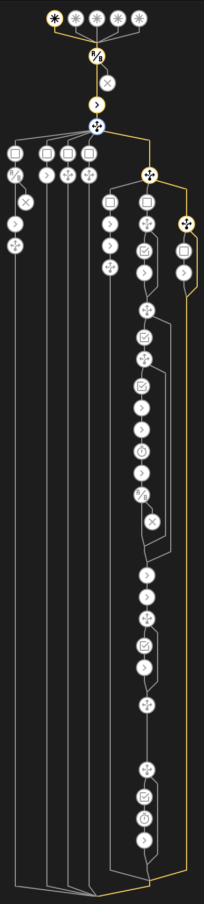

[](https://my.home-assistant.io/redirect/blueprint_import/?blueprint_url=https%3A%2F%2Fgithub.com%2Fleofabri%2Fhassio_appliance-status-monitor%2Fblob%2Fmain%2Fappliance-status-monitor.yaml)

<p align="center">
  
</p>

This is my simple automation to control the most power-hungry appliances in my house. I use this for my dishwasher and washing machine.


So far the results have been great! And my family ❤️ it. I hope you'll find this useful as well.


## 📋 Features

I took inspiration from this automation [here](https://community.home-assistant.io/t/notify-or-do-something-when-an-appliance-like-a-dishwasher-or-washing-machine-finishes/254841) and decided to make my version of it. 

This is what's different:

*   **Set your own custom actions** for each of the following states:
    *   On Start
    *   On Finish
    *   On Resume After Overload
    *   On Powered Again After Overload
*   **The appliance has its own** [**State Machine**](https://en.wikipedia.org/wiki/Finite-state_machine)
    *   You can tell if it's in one of the following states:
        *   unplugged
        *   idle
        *   paused
        *   job\_ongoing
        *   job\_completed
    *   Note: Each state transition is handled automatically, you just have to provide the initial configuration!
*   **More triggers: more control,** even after Home Assistant reboots
    *   This automation is set to run on each power read, the starting/finishing thresholds comparison is done in the actions section. This allows more granular control over what's happening. There might be a better way of doing this. If you know one, feel free to share it!
*   **Faster machine start-finish detection**: one of the problems that I always face is timing. What if you want to measure how long it took for your appliance to complete its job? The automation has to be very reactive. This logic should solve that problem for you.


## ☑️ What is needed to run this:

To achieve this level of control, the socket has to have some basic features, like: 
- power monitoring (polling rate of a maximum of 60 sec for best results)
- ON/OFF control over HASSIO
- status reporting

Mine is a [u]Meross MSS310EU[/u].

To get the pause state to work properly, you also need another automation that can detect an overload. I'm not the author of that automation (which you can find [here](https://github.com/andbad/HA_PowerControl)). I have not tested my blueprint without this value, maybe it would still work, but it'd represent a big constraint for the whole blueprint.

### 1. The State Machine entries (input_select)
You need to create the input_select for our appliance.  
To do that, head over to `configuration.yaml` and edit it by creating this:

```yaml
input_select:
  <your_appliance_name>_state_machine:
    name: <Your Appliance Name> - State Machine
    options:
      - unplugged
      - idle
      - paused
      - job_ongoing
      - job_completed
    icon: mdi:<your_appliance_icon>
```

Please make sure to edit `<your_appliance_name>`, `<Your Appliance Name>` and `<your_appliance_icon>` accordingly.

For example, my appliance is a washing machine, so I'll do the following:

`<your_appliance_name>` = washing_machine
`<Your Appliance Name>` = Washing Machine
`<your_appliance_icon>` = washing-machine (taken from here https://materialdesignicons.com/)


The result:
```yaml
input_select:
  washing_machine_state_machine:
    name: Washing Machine - State Machine
    options:
      - unplugged
      - idle
      - paused
      - job_ongoing
      - job_completed
    icon: mdi:washing-machine
```

### 2. The Job Cycle indicator (input_boolean)

```yaml
input_boolean:
  <your_appliance_name>_job_cycle:
    name: <Your Appliance Name> - Job Cycle
    icon: mdi:<your_appliance_icon>
```

Please make sure to edit `<your_appliance_name>`, `<Your Appliance Name>` and `<your_appliance_icon>` accordingly. The variables are the same as before.

# Congratulations! Your appliance is now smarter 🧠
Okay, done... but now, please reboot Home Assistant ([at this page](https://my.home-assistant.io/redirect/server_controls/) -> Verify & if okay, Reboot)

1.  Add the automation blueprint to your Home Assistant   [](https://my.home-assistant.io/redirect/blueprint_import/?blueprint_url=https%3A%2F%2Fgithub.com%2Fleofabri%2Fhassio_appliance-status-monitor%2Fblob%2Fmain%2Fappliance-status-monitor.yaml)
2.  Create a new automation from that blueprint
3.  Configure the variables as indicated inside of the blueprint's UI

Have fun!
