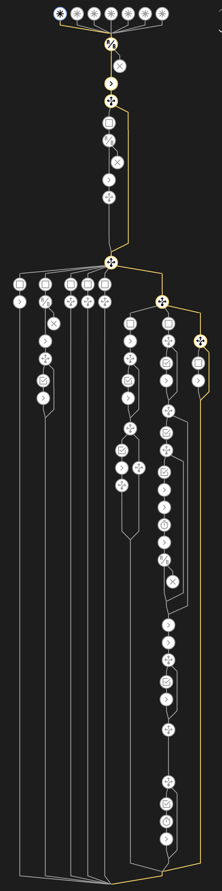
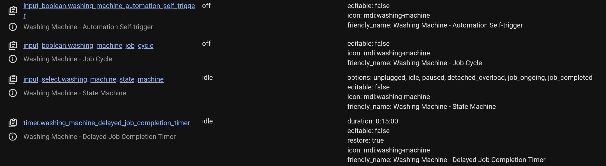
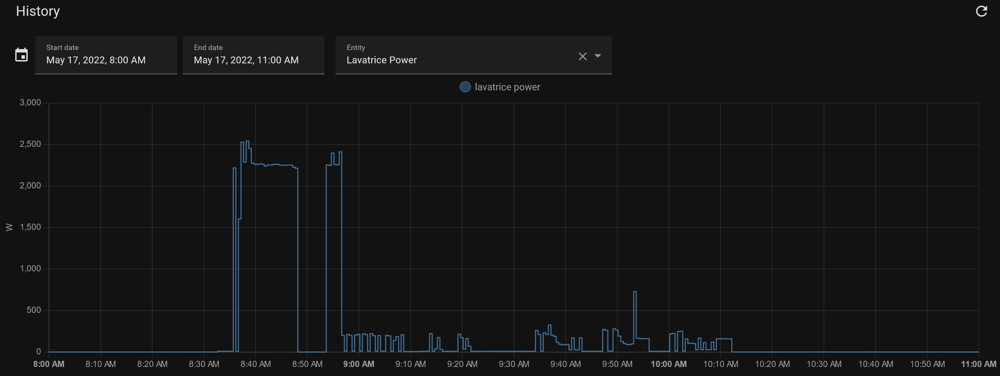
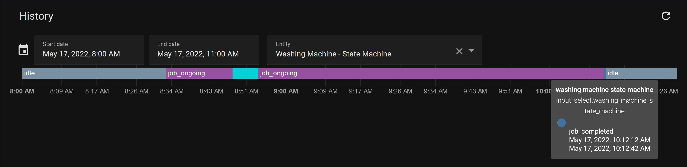

# 🔌 Detect and monitor the status of an appliance based on its power consumption - V2.1.0 ✨
### Automation Blueprint for Home Assistant

<br>

<p align="center">
  
</p>

This is the automation I made to control the status of the most power-hungry appliances in my house.

There aren’t numerous blueprints that do what I want, and I’m sure that I have the skills to automate my machines without wasting money and buying them new. Here’s my cheap and reliable solution that addresses the problem, once and for all.

I use this for my dishwasher and washing machine and the results have been great! The blueprint is very extensible and easy to use.
My family ❤️s this thing! Even if they don’t understand its complexity and get what all the fuss is about.

As I said, I’m sharing this with everyone. I’m sure that you’ll find it useful!

## 📋 Features

For the record: there is more inside. Anyways, here's a summary:

*   **Set your own custom actions** for each of the following conditions:
      * when an overload occurs
      * when the overload situation is solved, now paused
      * when the appliance is plugged back in, now paused
      * when the overload situation is solved, now resuming
      * when a new job cycle begins
      * when a job cycle resumes
      * when a job cycle is finished

<br>
  
*   **The appliance has its own** [**State Machine**](https://en.wikipedia.org/wiki/Finite-state_machine)
    *   You can tell if it's in one of the following states:
          - <strong><u><ins>unplugged</ins></u></strong> - The appliance is no longer powered. 
            It happens when the user manually turns off the smart socket (from HA or the socket itself).
            
          - <strong><u><ins>idle</ins></u></strong> - There is no pending job, the machine is powered but idling.
            
          - <strong><u><ins>paused</ins></u></strong> - Indicates that a job is pending (incomplete cycle) but the appliance is not performing it. The inhibitors of these state are the <strong><i>datached_overload</i></strong> and <strong><i>unplugged</i></strong> states. 
            In this condition, the Power absorption is lower than the finishing power threshold. The appliance must be off (maybe the user turned it off manually or maybe the job needs some time to recover).
            The blueprint is waiting for the appliance to resume.

            <strong>Pro Tip!</strong> You could also use this to diagnose and warn if a job is not resumed after x minutes. 
            
          - <strong><u><ins>detached_overload</ins></u></strong> - This happens when, during a cycle, the appliance used too much power and was therefore suspended. It is also technically unplugged.
            
          - <strong><u><ins>job_ongoing</ins></u></strong> - Triggered in two cases:
              - when a new job cycle begins: the previous one is completed and the Starting Power threshold is surpassed.
              - when a job is resumed.
              
          - <strong><u><ins>job_completed</ins></u></strong> - Triggered when the current incomplete job cycle is finished. The appliance consumes less than the Finishing Power threshold (also with the possibility of selecting for how long).

        ...

        <strong>Note:</strong> Each state transition is handled automatically, you just have to provide the initial configuration.
*   **More triggers: more control,** even if Home Assistant reboots!
    *   This automation is triggered on each power read. I'm doing the starting/finishing thresholds magic in the "actions" section, and you can also add some of your own. 
The objective of this automation is to allow a more granular control over what's happening.
*   **Faster machine start-to-finish detection**: one of the problems that I always face is timing. <i>What if you want to measure how long it took for your appliance to complete its job?</i> The automation has to be <strong>very reactive</strong>. This logic should solve that problem for you.
*   **Unreliable power absorption filtering and inhibition**: prevents the blueprint from thinking that a job was completed as soon as the power falls below the finishing power threshold. You can set your own timing here.
  
<br>

Interested? Great! Let's install it!
## What do I need to run this blueprint? 🗸

### Premise
To achieve this level of control the socket must have some basic features, like: 
- power monitoring (polling rate of a maximum of 60 sec for best results)
- ON/OFF control over HASSIO
- status reporting

Mine is a <strong>Meross MSS310EU</strong>, but it shouldn't be that important.

- To get the pause state to work properly, you also need another automation that can detect an overload. I'm not the author of any of that, but the one I'm using is [here](https://github.com/andbad/HA_PowerControl) (disclaimer: it's just in Italian 🍝). <br>

...

## Let's make some helper variables (<i style="text-color: red">mandatory</i>)
To make those, head over to `configuration.yaml` and add the following pieces of code:

><strong>PRESETS</strong> - If want to simplify this even more, check out one of the pre-made [`config.yaml`](https://github.com/leofabri/hassio_appliance-status-monitor/tree/main/configuration-examples) examples that I prepared.
### 1. The State Machine

```yaml
input_select:
  <your_appliance_name>_state_machine:
    name: <Your Appliance Name> - State Machine
    options:
      - unplugged
      - idle
      - paused
      - detached_overload
      - job_ongoing
      - job_completed
    icon: mdi:<your_appliance_icon>
  # ... <- Your other input_select(s) (if you have any)
```


### 2. The Job Cycle indicator

```yaml
input_boolean:
  <your_appliance_name>_job_cycle:
    name: <Your Appliance Name> - Job Cycle
    icon: mdi:<your_appliance_icon>

  # ... <- Your other input_boolean(s) (if you have any)
```

### 3. The delay timer (🆕 <i>added in version V2.0.0</i>)

```yaml
timer:
  <your_appliance_name>_delayed_job_completion_timer:
    name: <Your Appliance Name> - Delayed Job Completion Timer
    duration: "00:15:00" # <- Note that the time here. Leave it 15 min
    restore: true
    icon: mdi:<your_appliance_icon>

  # ... <- Your other timers (if you have any)
```

### 4. The automation self-trigger (🆕 <i>added in version V2.0.0</i>)
```yaml
input_boolean:
  <your_appliance_name>_automation_self_trigger:
    name: <Your Appliance Name> - Automation Self-trigger
    icon: mdi:<your_appliance_icon>

  # ... <- Your other input_boolean(s) (if you have any)
```

Important! Please make sure to edit all the fields `<your_appliance_name>`, `<Your Appliance Name>` and `<your_appliance_icon>` accordingly.

```yaml
# Example (Washing Machine):
#
# <your_appliance_name> = washing_machine
# <Your Appliance Name> = Washing Machine
# <your_appliance_icon> = washing-machine (taken from here https://materialdesignicons.com/)

# # # Result:
# # input_select:
# #   washing_machine_state_machine:
# #     name: Washing Machine - State Machine
# #     options:
# #       - unplugged
# #       - idle
# #       - paused
# #       - job_ongoing
# #       - job_completed
# #     icon: mdi:washing-machine

# # and so on ...
```
><strong>PRESETS</strong> - If want to simplify this even more, check out one of the pre-made [`config.yaml`](https://github.com/leofabri/hassio_appliance-status-monitor/tree/main/configuration-examples) examples that I prepared.

# ➕ Download & Import
>Are you tryingt to update? You should follow [this instead](#to-update).

If you have just created your helpers, please reboot Home Assistant ([at this page](https://my.home-assistant.io/redirect/server_controls/) -> Verify & if okay, Reboot)

1.  Add this blueprint to your Home Assistant  [](https://my.home-assistant.io/redirect/blueprint_import/?blueprint_url=https%3A%2F%2Fgithub.com%2Fleofabri%2Fhassio_appliance-status-monitor%2Fblob%2Fmain%2Fappliance-status-monitor.yaml)
2.  Create a New Automation from that blueprint
3.  Configure the variables as indicated inside the blueprint's UI

## Results 🎉
### You should see the 4 new entities:

> <strong>Warning |</strong> always use those entities as indicators, do not change their values manually! Leave that to your automation

<figure align="center">
  
  <figcaption><p align="center">Washing Machine entities</p></figcaption>
</figure>

### During a job cycle:

<figure align="center">
  
  <figcaption><p align="center">This is my washing machine. Power usage example</p>
</figcaption>
</figure>

<figure align="center">
  
  <figcaption><p align="center">The State machine. The one in light blue is a simulated overload situation.</p>
</figcaption>
</figure>


## Congratulations! Your appliance is now smarter 🧠
<br>
<br>

___
<br>
<br>


# 📯Important notice! 🚨
### 🆕 The code has been updated
1. [**Version 2.1.0 of 05/31/2022**]() - [**FIX!** | **IMPROVEMENTS**] 
   - Fixes an issue with the timer that was restarting indefinitely. The delay should now be working.
   - Added two more triggers: when HA starts, when the automation is reloaded.
   - The description inside the automation has been updated/improved.
   - The order of definition of the input entities is now different.
   - There's a new version tag visible inside the blueprint's description.

>##  <p id="update">**To update:**</p>
>
>   * Open this page [](https://my.home-assistant.io/redirect/blueprints/) (just click the link, it's magical) and scroll till you find "*Monitor the status of an appliance - by leofabri*" and delete it by clicking on the trash bin 🗑. Don't worry, we'll add it right back in a few sec, you can leave the automation as it is for now.
>   * Create the missing helpers (entities) as shown in the instructions
>   * Add the blueprint again [](https://my.home-assistant.io/redirect/blueprint_import/?blueprint_url=https%3A%2F%2Fgithub.com%2Fleofabri%2Fhassio_appliance-status-monitor%2Fblob%2Fmain%2Fappliance-status-monitor.yaml) and reload home assistant.
>   * Open your automation and add the previously created helpers (entities)
>  
>  <br>


2. [**Version 2.0.0 of 05/20/2022**](https://github.com/leofabri/hassio_appliance-status-monitor/tree/release/v2.0.0) - [**MAJOR UPDATE**] Introduces a ton of new features:

   - **+-FIXED+- some subtle 🐛🐛🐛**: I hate bugs (the coded ones ofc)! I did notice some strange and unwanted behavior during some state state transitions. V1.0.1 seems to become unreliable when the user manually turns on and off the smart socket. This is a fix to that and to other smaller things.

   - **+ADDED+ Low Power Threshold -> job_completed inhibition**: [@siklosi](https://community.home-assistant.io/t/detect-and-monitor-the-status-of-an-appliance-based-on-its-power-consumption-updated-v1-0-1/421670/4?u=leofabri) found that some appliances may intermittently absorb less than the Low Power Threshold, and that causes the automation to act like if multiple jobs were started and finished consecutively.
  
      This version aims to fix this issue by waiting and checking if, during that period, the appliance's power consumption rises again. 
      The only disadvantage is that waiting for a long time also means that a possible job length estimate is less accurate because the state machine is not as reactive.
  
    - **+ADDED+ Automation can now trigger itself**: This is very useful because in a case like the above, when the appliance consumes 0 Watts steadily, there would be no trigger, as no change in power absorption is detected. The self-triggering solution will now prevent it from being 'stuck' in the same state because of this problem.
  
    - **+ADDED+ detached_overload state**: The new detached_overload state was introduced to make things tidier and clearer to understand. The pause state indicates that the appliance is not resuming the previous job.

    - **/CHANGED/** The automation now runs in restart mode, not in single-mode anymore. I did this because I am prioritizing the trigger over the internal checks.


3. **[Version 1.0.1 of 05/16/2022](https://github.com/leofabri/hassio_appliance-status-monitor/tree/1.0.1)** - DEPRECATED - [**FIX!**] *Fixes the error of the 'idle' state which was not working correctly.*
    
