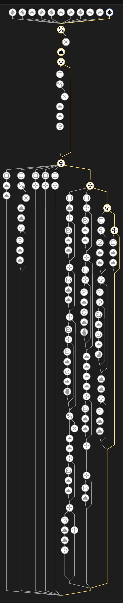
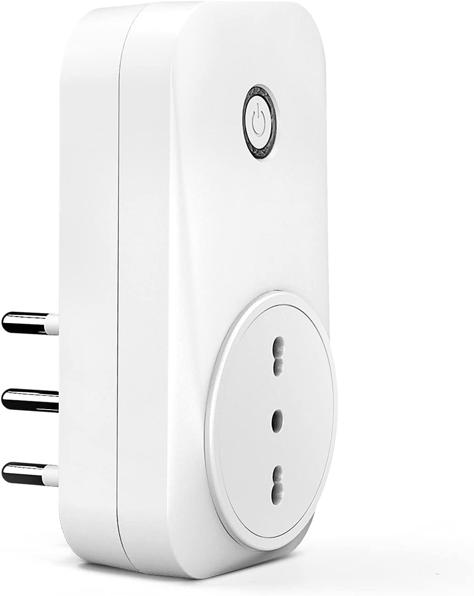

# 🔌 Detect the state of your appliances based on their power consumption - V3.0.0 ✨

### [Go to the official discussion on the Home Assistant Forum](https://community.home-assistant.io/t/detect-and-monitor-the-state-of-an-appliance-based-on-its-power-consumption-v2-1-1-updated/421670)

<br>

<p align="center">
  
</p>

<p align="center" position="absolute">
  
  
</p>


---

## Table of contents
- [**Introduction**](#introduction)
- [**Features**](#features)
- [**Installation**](#installation)
  - [📋 **Requirements**](#requirements-what-do-i-need-to-run-this-blueprint)
  - [⚙️ **Enabling the `packages/`**](#%EF%B8%8F-enabling-the-packages)
  - [➕ **Download & Import**](#-download--import)
  - [🧰 **Finalizing the configuration**](#-finalizing-the-configuration)
  - [🪛 **Fine-tuning the values**](#-fine-tuning-the-automation)
  - [🎉 **Final results**](#-final-results)
- [**Versions & Changelog**](#versions--changelog)
- [**Q&A - Things you may want to know**](#qa---things-you-may-want-to-know)
---
<br>

# **Introduction**

This automation can detect what your appliances are doing, inferring their state from their power consumption. All you need to get started is a smart socket with a power monitoring feature.

## Why does this exist?

There aren’t numerous blueprints that do what I need, and I want to automate my machines without wasting money to buy them new. Here’s my cheap and reliable solution that addresses the problem, once and for all. I believe that controlling appliances should be easy for everyone. I’m sure that you’ll find it useful!

## Use-cases
I use this for my dishwasher, my washing machine, the electric bicycle and my desk. The results have been great! The blueprint is very extensible and easy to use.

My family ❤️ this thing! Even if they don’t understand what all the fuss is about.

---
# **Features**

For the record: there is more inside. Here's a summary of the most remarkable ones:
*   🎛️ **More triggers: more control,** <u>even across Home Assistant reboots!</u>
    **This automation is triggered on each power read**. I'm placing the starting/finishing thresholds magic in the "actions" section, and you can also add some of your own.
    The goal is to allow a more granular control over what's happening. We also want to do that reliably.

*   ⏱️ **Faster machine start-to-finish detection**: one of the problems that I always face is **timing**. <i>What if you want to measure how long it took for your appliance to complete its job?</i> The automation has to be <strong>very reactive</strong> and detect a state change as fast as possible. This logic should solve that problem for you.
  
*   📉 **Unreliable power absorption filtering and inhibition**: This is useful! It prevents the blueprint from thinking that a job was completed as soon as the power falls below the finishing power threshold. The same option is present for the starting power threshold. You can tune this to your needs.
  
*   📅 **Set your own custom actions** for each of the following conditions (OPTIONAL):
      * #Overloads (if used):  
        * when an overload occurs
        * when the overload situation is solved, now paused
        * when the overload situation is solved, now resuming
      * #Socket's state change (On <-> Off):
        * when the appliance is plugged back in, now paused
      * #Job-cycle based:
        * when a new job cycle begins
        * when a job cycle resumes
        * when a job cycle is finished

*   🥷 **The appliance has its own** [**State Machine**](https://en.wikipedia.org/wiki/Finite-state_machine)
    *   Meaning that you can tell if it's in one of the following states:
  
| States | | |
| ------ | --- | --- |
| N°     | Name | Description |
| 00     | **unplugged** | The appliance is no longer powered. The smart socket is off.  |
| 01     | **idle** | There is no pending job, the machine is powered but idling. |
| 02     | **paused** | The appliance has a pending job (cycle still on) but the appliance is not performing it. The state also indicates that the Power absorption is lower than the finishing power threshold, but the previous state indicates that the appliance hasn't completed its job yet. The appliance has to be off (the user may have turned it off manually), or maybe the job needs some time to recover. The automation is now waiting for the appliance to resume. |
| 03     | **detached_overload** | Entered when, during a cycle, the appliance used too much power and was therefore suspended. It is also technically unplugged. The state works only if Appliance Overload State is enabled `appliance_overload_state_enabled: true` and `appliance_suspended_sensor: input_number.some_power_overload_sensor_is_present`  |
| 04     | **job_ongoing** | Signals that a cycle has to be complete and a new or a previous job is ongoing |
| 05     | **job_completed** | Entered when the current incomplete job cycle is finished. The appliance uses less power than the **Finishing Power threshold** ( `appliance_finishing_power_threshold`) (with the possibility of selecting for how long). |

Do you want to know more about the automation's structure? [You might find this interesting](./docs/Automation%20Structure.md).


    Note: Each state's transition is handled automatically, you just have to provide the initial configuration.
<br>

# Installation

## 📋**Requirements:** What do I need to run this blueprint?

To achieve this level of control **the socket has have some basic features**: 
- Power monitoring (a polling rate of circa 60 sec. or less for best results)
- ON/OFF control over Home Assistant
- State reporting (if it's ON or OFF)

<p align="center">
  
</p>

Mine is a <strong>Meross MSS310EU</strong>, but all the smart sockets with the mentioned features should be supported.

### One more thing:
- <u>OPTIONAL:</u> To get **the pause state** to work properly, **you also need another automation that can detect an overload**. I'm not the author of that, but the one I'm using is [here](https://github.com/andbad/HA_PowerControl) (disclaimer: it's just in Italian 🍝). <br>

---

## ⚙️ **Enabling the `packages/`**

Creating a package is super easy. Some of you may already have the right configuration in place, but I'll show you how to do that anyway.

> **Note:** you need to have the VS Code integration enabled. This will allow you to manually edit the necessary files. Need help with that? [Read this](https://www.home-assistant.io/docs/configuration/).

Back to us, here are the two steps for creating a package:

1. **Make sure that you have a directory called 'packages'**.
   
    If you are a beginner, or you are starting fresh with your HA installation, likely, the `packages` dir is not present.
   
   To add it, you can:
   > Open your HomeAssistant VS Code editor and create a directory called `packages` (<u>at the same level as the configuration.yaml</u> file).
  
   OR

   > Issue this command in the terminal section of your VS Code:
   >
   >  ```
   > cd /config && mkdir packages
   > ```
   > Easy-peasy.


   <u>**Result:**</u> You should see the packages' directory <u>**at the same level**</u> as the `configuration.yaml` file.


2. **Make sure that the packages support is enabled** inside the [`configuration.yaml`](./home%20assistant/configuration.yaml) file as shown below:

    ```yaml
    homeassistant:
      packages: !include_dir_named packages/ ## Packages support enabled - Includes every .yaml file that is inside the packages/ directory
      ## Warning! Please pay attention to the indentation!
    ```

---


## ➕ **Download & Import**
>Are you **trying to update** to a newer version? [Let's do that in a snap! Follow this guide instead](./docs/Frequent%20Questions%20and%20Answers.md/#how-to-update).

Add this blueprint to your Home Assistant [](https://my.home-assistant.io/redirect/blueprint_import/?blueprint_url=https%3A%2F%2Fgithub.com%2Fleofabri%2Fhassio_appliance-status-monitor%2Fblob%2Fmain%2Fappliance-status-monitor.yaml)


---
## 🧰 **Finalizing the configuration**
**Remember: we will put all the configuration and the helpers in a package, organized by appliance**.

1. **Copy one of the packages of your choice to your `packages/` folder**: [See the packages section](./home%20assistant/packages/).
2. **Configure the automation either by:**
     - **Using one of the pre-configurations available [here](./home%20assistant/pre_configurations/)**. [<- Recommended]
     - Creating the automation in Home Assistant selecting _"**ASM - Monitor the state of an appliance - by leofabri**"_ in the Blueprints section [](https://my.home-assistant.io/redirect/blueprints/), then configure it manually.
---

## 🪛 **Fine-tuning the automation**

Please refer to the guide [here](./docs/How%20to%20find%20the%20right%20Power%20Thresholds.md).

---

## 🎉 **Final results**
### You should see the 4 new entities:

> <strong>Warning |</strong> always use those entities as indicators, do not change their values manually! Leave that to your automation

<figure align="center">
  
  <figcaption><p align="center">Washing Machine entities</p></figcaption>
</figure>

### During a job cycle:

<figure align="center">
  
  <figcaption><p align="center">This is my washing machine. Power usage example</p>
</figcaption>
</figure>

<figure align="center">
  
  <figcaption><p align="center">The State machine. The one in light blue is a simulated overload situation.</p>
</figcaption>
</figure>


## Done!


# Versions & Changelog:
- ### Version 3.0.0:
  - Some changes...

> ---
> The changes related to the **older versions** are <u>[here](./docs/Older%20Versions%20Changelog.md.md)</u>.
> 
> ---

---

## [**How do I know if there is a new version?**](./docs/Frequent%20Questions%20and%20Answers.md/#how-do-i-know-if-there-is-a-new-version)

---

##  [**How to update**](./docs/Frequent%20Questions%20and%20Answers.md/#how-to-update)
---

## [**Q&A - Things you may want to know**](./docs/Frequent%20Questions%20and%20Answers.md)

