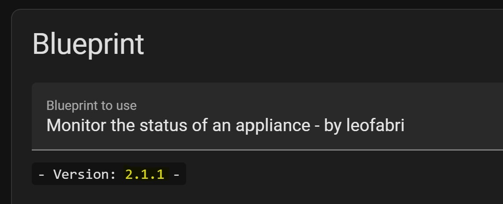

# Q&A - Things you may want to know

## Index:
  - [Q&A - Things you may want to know](#qa---things-you-may-want-to-know)
  - [Index:](#index)
    - [`#general`](#general)
    - [`#bugs`](#bugs)
    - [`#overloads`](#overloads)
    - [`#project`](#project)
---
---
## `#general`

1. ### **Is this able to survive reloading automations and Home Assistant?** 
    Yes!

2. ### **Why is this thing so big? That monstrosity doesn't even show correctly on my small screen!**
   I know 😅. There are many conditions, and those increase the visual width of the blueprint in the UI. On mobile devices, it's going to be a pain, but what's important here is that things work and that all the possible situations are handled.

3. ### **How is this different when compared to [Notify or do something when an appliance like a dishwasher or washing machine finishes](https://community.home-assistant.io/t/notify-or-do-something-when-an-appliance-like-a-dishwasher-or-washing-machine-finishes/254841)?** 
    It's very, very different and much more articulated. [Read here for more info](https://community.home-assistant.io/t/notify-or-do-something-when-an-appliance-like-a-dishwasher-or-washing-machine-finishes/254841/131?u=leofabri).

4. ### **Will this slowdown Home Assistant?** 
    Nope. The blueprint will run every time a new power read is polled or sent to HA. If there's no state change, the automation is basically doing nothing and completes super quickly.

5. ### **How do I update to a new version?** 
    Please follow the steps **[here](https://community.home-assistant.io/t/detect-and-monitor-the-status-of-an-appliance-based-on-its-power-consumption-v2-0-0-updated/421670/3)**.

---

## `#bugs`

1. ### **Why when I turn off *'appliance_overload_state_enabled'* in the blueprint's UI and save the change is discarded?**
    There is [a bug in Home Assistant](https://community.home-assistant.io/t/blueprint-booleans-not-saving-after-deployment/440382/2) that causes the UI to ignore the update the value of inputs like this. Sometimes, you'll have to go to "Edit in YAML" and define 'appliance_overload_state_enabled: true/false' to solve the issue.

  
2. ### **Why when I delete an entity in a selector in the blueprint's UI and save the change is discarded?**
   See the problem above. The only solution so far is to manually delete the entity in the "Edit in YAML" mode.

---

## `#overloads`
1. ### **What is an overload situation? When does it happen?**
   An overload occurs when the appliance is drawing too much power and this affects the entire home grid. This usually triggers your circuit breaker.

2. ### **What does this blueprint do during an overload?**
    If the "Appliance Suspended entity" was configured, the state machine should transition to the `detached_overload` state.
  
3. ### **Is this blueprint a solution to my overloads?**
    Nope. It just stores the states of your appliance, it doesn't diagnose anything, it notes that it happened. 
    
    **[HA_PowerControl](https://github.com/andbad/HA_PowerControl)** is instead a separate package that takes care of detaching the loads progressively based on a settable priority. The package itself does the job, but the problem is that the appliance is not self-conscious of being the cause of an overload. The `detached_overload` state adds that consciousness. 

4. ### **Do I really need HA_PowerControl?**
    No. I’m allowing the user to bind this blueprint to whatever system they have for handling those situations. 
    
    You might not want to use anything at all! If that's the case, just leave the "Appliance Suspended entity" empty.

5. ### **HA_PowerControl is just in Italian 🍝.. is there no other alternative?**
     I was unable to find one yet. [I asked](https://github.com/andbad/HA_PowerControl/issues/15) the author if I'm allowed to translate it ad he approves, but it's still too early to talk about a release.

---

## `#project`

1. ### **Why is the Git repo's main branch not the development branch?** —  [Read here to see why](/Versioning.md)

2. ### **How do I know if there is a new version?**
    Easy! — [Look for the current version number in the title on GitHub](https://github.com/leofabri/hassio_appliance-status-monitor#-detect-and-monitor-the-status-of-an-appliance-based-on-its-power-consumption). Now, open one of the automations that currently uses this blueprint and notice the version tag:

    <p align="center">
    
    </p>

3. ### **How to update:**
    Open this page [](https://my.home-assistant.io/redirect/blueprints/) (just click the link, it's magical) and scroll till you find **"ASM - Monitor the state of an appliance - by leofabri" and delete it** by clicking on the trash bin 🗑. Don't worry, we'll add it right back in a few secs, you can leave the automation as it is for now. <br>

    Create the missing helpers (entities) as shown in the instructions
    Add the blueprint again [](https://my.home-assistant.io/redirect/blueprint_import/?blueprint_url=https%3A%2F%2Fgithub.com%2Fleofabri%2Fhassio_appliance-status-monitor%2Fblob%2Fmain%2Fappliance-status-monitor.yaml), and reload Home Assistant.

    Open your automation and add the previously created helpers (entities)

    If you want to use the command line, you can always issue the following command:

    ```
    cd /config/blueprints/automation/leofabri && curl -sSL https://raw.githubusercontent.com/leofabri/hassio_appliance-status-monitor/release/v3.0.0-dev/appliance-status-monitor.yaml -O
    ```

4. ### **Do you want to know more about this automation's structure?** [You might find this interesting](./Automation%20Structure.md).

...
### Got more questions? [Feel free to ask!](https://community.home-assistant.io/t/detect-and-monitor-the-state-of-an-appliance-based-on-its-power-consumption-v2-1-1-updated/) 🙂