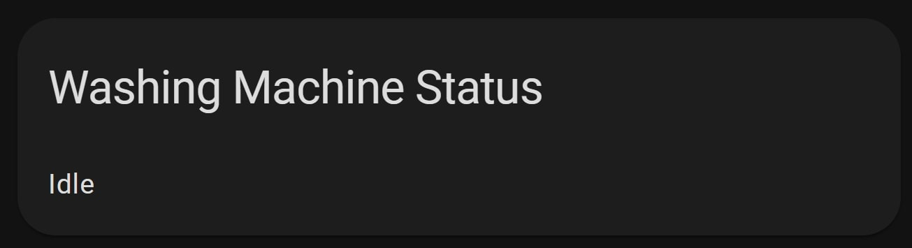
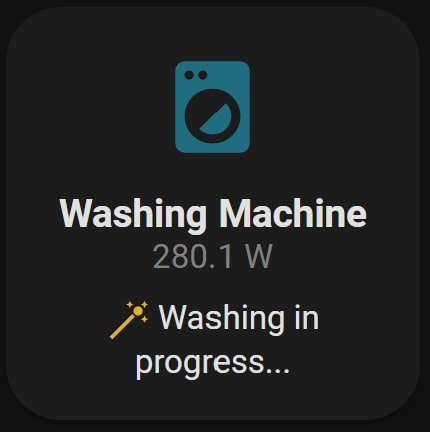

# How to use ASM in the UI 

- [**How to use ASM in the UI**](#how-to-use-asm-in-the-ui)
  - [**How to make the states self-explanatory**](#how-to-make-the-states-self-explainatory)
    - [1. Create a translation sensor](#1-create-a-translation-sensor)
    - [2. Translating the states directly in the UI](#2-translating-the-states-directly-in-the-ui)
      - [Example with a markdown card](#example-with-a-markdown-card)
      - [Example with custom:button-card](#example-with-custombutton-card)

Now that you have the blueprint setup and running, you are wondering what to do with it. You'd likely want to display the state of your appliance on the Lovelace's UI.

**<u>Warning!</u> _Please be very cautious with how you display the variables to your users! Make sure that neither you nor anyone else is allowed to change any of your `input_`s manually. Those variables are meant to be edited by the automation, not by the user. The user can, on the other hand, use those variables to display relevant information about the state of the appliance._**

## How to make the states self-explanatory
Now, let's get back to us. The first issue you might encounter is that your states aren't telling you the full story about the appliance. If you have a washing machine and your `input_select.washing_machine_state_machine` is equal to `job_ongoing` but what does that mean? Instead of displaying that ambiguous state in the UI, you want to read something like `The washing is in progress`, or something like that.

There are two ways to accomplish what we described:

### 1. Create a translation sensor

Here are a few considerations about this solution:
- **Advantages**: 
    - The configuration of your automation is all in one place (in you .yaml file), it's super portable and organized;
    - This is by far the easiest and fastest way of doing that;
    - A sensor is way more usable and supported by most Lovelace cards;
    - Your helpers wouldn't be directly exposed to the users, so there's no risk of compromising the automation's stability.
- **Disadvantages**: 
    - It's quite inappropriate to use a sensor for 'translating' things. It works, but it might not be considered a good practice.

If you decide to go this way, you should place a new sensor inside the `packages/asm_<your_appliance_name>.yaml` file.
I'm already providing all the necessary code in those files, although it's commented out/disabled by default. Please read your `asm_<your_appliance_name>.yaml` file to know how to activate this feature.

See the line that says: `ADDITIONAL OPTIONAL FEATURES` and follow the instructions ([Example](../home%20assistant/packages/universal/asm_your_appliance_name.yaml)).


### 2. Translating the states directly in the UI
You can make your states more verbose right from the UI. 

- **Advantages**: you are not creating a separate sensor. 
- **Disadvantages**: 
  - Your code is not portable;
  - You'd need to copy the same logic over and over for each one of your appliances;
  - The code is more subject to personal preference, and documenting it is harder;
  - You need a template card (like Markdown), you can't use an entity card.


#### **Example with a markdown card:**

<p align="center">

</p>

```yaml
type: markdown
content: |-
  
  
  Unplugged
  
  Idle
   
  Paused waiting to resume
  
  Detached temporarily, overload detected
  
  Washing in progress
  
  Washing complete
  
title: Washing Machine Status
```

#### **Example with custom:button-card**

<p align="center">

</p>

```yaml
type: custom:button-card
entity: input_boolean.washing_machine_job_cycle
icon: mdi:washing-machine
name: Washing Machine
label: |
  [[[
    return states['sensor.washing_machine_power'].state + " W";
  ]]]
tap_action:
  action: none
show_label: true
color: rgb(28, 128, 199)
state:
  - value: 'off'
    color: firebrick
    styles:
      card:
        - filter: opacity(50%)
      icon:
        - filter: grayscale(100%)
  - value: 'on'
    color: '#25CCF7'
    styles:
      icon:
        - animation: blink 4s ease infinite
styles:
  card:
    - width: 150px
    - height: 150px
  label:
    - color: gray
    - font-size: 12px
  grid:
    - grid-template-areas: '"i" "n" "s" "l" "job-status"'
    - grid-template-columns: 1fr
    - grid-template-rows: 1fr min-content min-content
  img_cell:
    - align-self: center
    - text-align: center
    - width: 100px
  name:
    - justify-self: center
    - font-weight: bold
    - font-size: 14px
  state:
    - justify-self: start
    - padding-left: 10px
  custom_fields:
    job-status:
      - align-self: start
      - justify-self: middle
      - font-size: 12px
      - padding: 8px
      - line-break: auto
      - display: block
      - white-space: initial
      - text-overflow: initial
      - overflow: initial
custom_fields:
  job-status: |-
    [[[
      let state = states['input_select.washing_machine_state_machine'].state;
      if (state == 'idle'){
        return `<ha-icon
        icon='mdi:sleep'
        style='width: 16px; height: 16px; color: #273c75'>
        </ha-icon> Idle, ready`;
      } else if (state == 'unplugged'){
        return `<ha-icon
        icon="mdi:power-plug-off"
        style="width: 16px; height: 16px; color: #487eb0;">
        </ha-icon> Unplugged`;
      } else if (state == 'paused') {
        return `<ha-icon
        icon="mdi:pause"
        style="width: 16px; height: 16px; color: #f39c12;">
        </ha-icon> Paused. Waiting for the washing process to resume...`;
      } else if (state == 'detached_overload') {
        return `<ha-icon
        icon="mdi:alert-decagram"
        style="width: 16px; height: 16px; color: #c0392b;">
        </ha-icon> Overload! Detached temporarily`;
      } else if (state == 'job_ongoing') {
        return `<ha-icon
        icon="mdi:magic-staff"
        style="width: 16px; height: 16px; color: #e1b12c;">
        </ha-icon> Washing in progress...`;
      } else if (state == 'job_completed') {
        return `<ha-icon
        icon="mdi:check-all"
        style="width: 16px; height: 16px; color: #2ecc71;">
        </ha-icon> Washing completed`;
      }
      return "NA";
    ]]]
```

As always, remember to Edit the entities to match yours.

---

More examples will come soon...