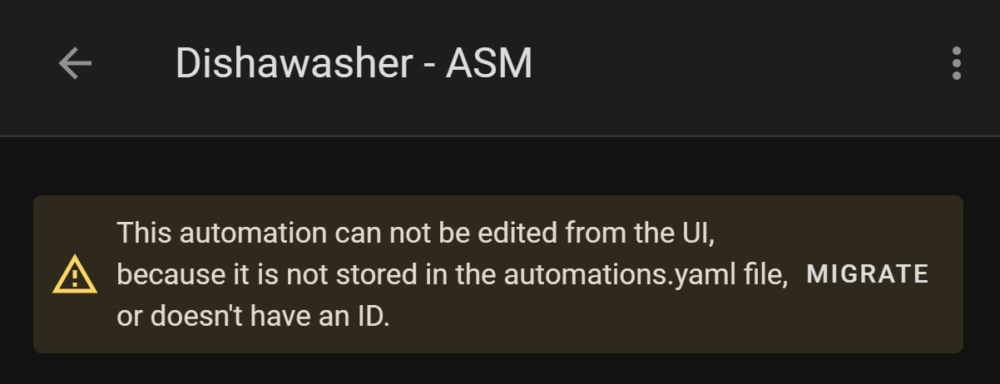

# How to use the `_noui_starter.yaml` files:

These files allow you to configure the blueprint **without** using the main Home Assistant UI.

If you intend to use one of these configuration files you just have to copy/paste the one you want inside your `packages/my_appliance` folder.

The resulting structure will look like something like this (example for the dishwasher):

- `packages/`
  - `dishwasher/`
    - `asm_dishwasher.yaml` # Contains and instantiates all the helpers needed for the blueprint to run. You likely don't want to touch this file (unless you want to use some additional sensors).
    - `asm_dishwasher_noui_stater.yaml` # You can configure all the variables you'd see in the UI here

Notice how clean the setup is. Ideally, we want to keep the setup as tidy as possible.

## Then what?

Then you are done. 

[Verify and restart](https://my.home-assistant.io/redirect/server_controls/) your Home Assistant, and you'll see that a new Automation whith the name "`MyAppliance - ASM`" is present in the automations section .

## The Migrate option
If you click on the automation that just appeared, you'll see at the top of the page this message:

  

Please DO NOT MIGRATE the automation! Doing that will clone the blueprint entirely, and you will not be able to push future updates!

If you want to edit the configuration, you have to do that through VSCode. While this is a considerable disadvantage, it also makes the configuration more portable and easy to maintain.
